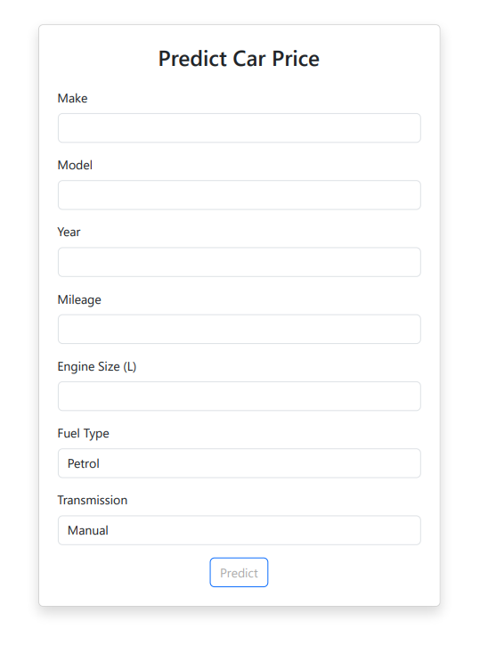
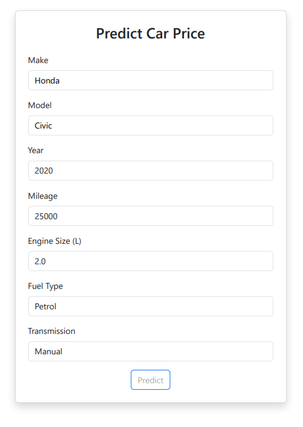
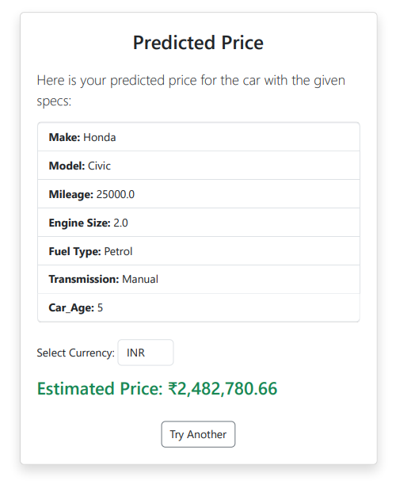

# 🚗 Car Price Predictor

  

## ✨ Overview

Car Price Predictor is a futuristic web app that leverages machine learning to estimate car prices based on user input. Built with Python, Flask, and a robust ML pipeline, it provides instant price predictions and a modern, interactive UI—including a built-in currency converter! 🌍💸

---

## 🚀 Features

- 🔮 **Instant Car Price Prediction**
- 🌐 **Currency Converter** (USD, INR, EUR, GBP)
- 📊 **User-Friendly Interface**
- 🧠 **ML Model Trained on Global Data**
- 📷 **Visual Results with Screenshots**

---

## 🖼️ Screenshots

| Home Page | Prediction Form | Result Page |
|:---:|:---:|:---:|
|  |  |  |

---

## 🏗️ How It Works

1. Enter your car's details (make, model, year, mileage, etc.)
2. The app predicts the price using a machine learning model
3. View the result in your chosen currency

---

## ⚠️ Disclaimer

> **Note:** This model was trained on a global dataset (USD prices). Predictions are correct in dataset context but don’t always match Indian market prices. 🇮🇳

---

## 🛠️ Tech Stack

- Python 3.8+
- Flask
- Pandas, scikit-learn, joblib
- Bootstrap 5

---

## 🚦 Getting Started

1. **Clone the repo:**
   ```bash
   git clone https://github.com/dinraj910/car-price-predictor.git
   cd car-price-predictor
   ```
2. **Install dependencies:**
   ```bash
   pip install -r requirements.txt
   ```
3. **Run the app:**
   ```bash
   python app.py
   ```
4. **Open in browser:**
   Visit [http://localhost:5000](http://localhost:5000)

---

## 📁 Project Structure

```
├── app.py
├── requirements.txt
├── models/
│   └── car_price_model.pkl
├── static/
│   └── style.css
├── templates/
│   ├── index.html
│   └── result.html
└── screenshots/
    ├── home.png
    ├── form.png
    └── result.png
```

---

## 🤝 Contributing

Pull requests are welcome! For major changes, please open an issue first to discuss what you would like to change.

---

## 📜 License

[MIT](LICENSE)

---

## 🙏 Acknowledgements

- [Bootstrap](https://getbootstrap.com/)
- [Flask](https://flask.palletsprojects.com/)
- [scikit-learn](https://scikit-learn.org/)

---

> Made with ❤️ by DINRAJ K DINESH
